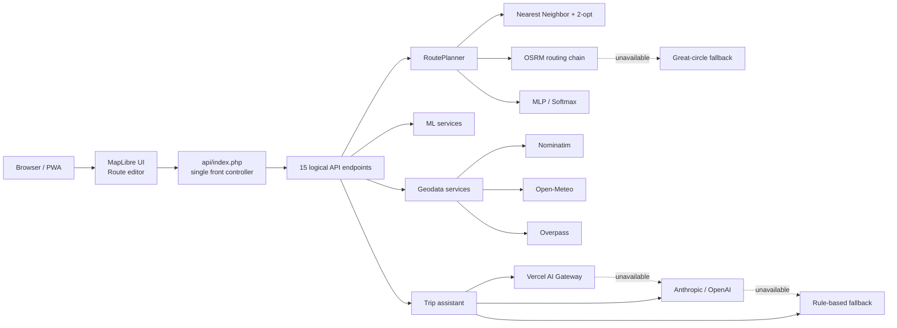
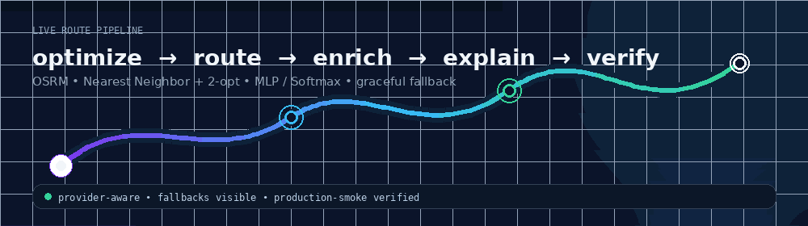

<div align="center">



<br>

[](https://smart-route-planner-vn.vercel.app/)
[](https://github.com/ViolettaNcl/smart-route-planner/actions/workflows/ci.yml)
[](https://github.com/ViolettaNcl/smart-route-planner/actions/workflows/production-smoke.yml)
[](composer.json)
[](Dockerfile)
[](LICENSE)

### An engineering-first route planning system

**TSP optimization · real road routing · from-scratch ML · explainability · resilient fallbacks · production verification**

[Live demo](https://smart-route-planner-vn.vercel.app/) ·
[Architecture](docs/architecture.en.md) ·
[API reference](docs/api-reference.en.md) ·
[ML notes](docs/neural_net.en.md) ·
[Русская документация](README.ru.md)

</div>

---

## Why this repository is interesting

Smart Route Planner is not a map mock-up. It is a compact routing system that combines classical optimization, geospatial providers, a hand-built machine-learning stack, and production-oriented failure handling.

| Engineering area | What is implemented |
|---|---|
| **Route optimization** | Nearest Neighbor + 2-opt while preserving trip endpoints |
| **Road routing** | OSRM road geometry, alternatives, turn-by-turn data, provider failover and transparent straight-line fallback |
| **Machine learning** | MLP with backpropagation and a Softmax baseline implemented in PHP without an ML framework |
| **ML quality** | train/validation/test separation, confusion matrix, per-class metrics, log loss, Brier score, ECE and cross-validation |
| **Explainability** | probabilities, model comparison, local sensitivity, counterfactual-style analysis, Model Card and training visualizations |
| **Geodata** | Nominatim, Open-Meteo, Overpass, MapLibre/OpenFreeMap |
| **Reliability** | token-bucket rate limiting, graceful degradation, health checks, HTTP integration tests and production smoke |
| **Delivery** | Vercel single-function front controller, Docker, GitHub Actions and Playwright product-flow tests |

> The project documents its limitations instead of hiding them: synthetic training data, heuristic optimization, public providers and ephemeral serverless storage are treated as engineering constraints.

---

## System at a glance



The Vercel deployment exposes one PHP Serverless Function, `api/index.php`, which dispatches **15 logical endpoints** to `server/endpoints/`.



---

## Product capabilities

### Route planning

- Address- or coordinate-based stops, up to **12 stops** per request.
- Optional optimization of intermediate stops while keeping start and finish fixed.
- Real road geometry, route alternatives and maneuver data when provided by OSRM.
- Estimated time, trip cost and CO₂.
- Google Maps / Yandex Maps hand-off.
- Share links without a database.
- Client-side GeoJSON, GPX and KML export.
- Local route history and favorites.

### Map experience

- MapLibre GL JS + OpenFreeMap.
- 2D / 3D switching, buildings and terrain/hillshade support.
- Cinematic route rendering with reduced-motion support.
- SVG fallback when WebGL or map layers fail.
- RU / EN, light / dark theme and PWA behavior.

### ML / AI

- MLP classifier written from scratch in PHP.
- Softmax-regression baseline.
- K-Means day splitter as a separate unsupervised task.
- A/B feedback statistics for MLP vs. Softmax.
- Model insight / quality surfaces and Model Card data.
- Reviewed feedback queue rather than unsafe request-time weight mutation.
- Trip narrative through Vercel AI Gateway, Anthropic/OpenAI, or a rule-based fallback.

---

## Request lifecycle

1. The browser submits stops to `/api/route.php`.
2. `api/index.php` validates and dispatches the logical endpoint.
3. Stops without coordinates are geocoded; coordinate-backed stops skip geocoding.
4. Intermediate stops can be optimized.
5. OSRM is queried for road routing and alternatives.
6. If road routing is unavailable, the system falls back to great-circle geometry rather than failing the full request.
7. MLP or Softmax evaluates the route-level features.
8. Time, cost and emissions are calculated.
9. Weather, POIs, model insight and the AI narrative enrich the result independently.

The separation is deliberate: optional providers can fail without taking down the primary route-planning flow.

---

## Quick start

### Hosted application

**https://smart-route-planner-vn.vercel.app/**

### Local PHP

Requirements: PHP **8.1+** with `curl`, `json`, `mbstring`.

Use the same routing behavior as the HTTP integration suite:

```bash
php -S 127.0.0.1:8000 -t public tests/Http/router.php
```

Open `http://127.0.0.1:8000`.

### Docker

```bash
cp .env.example .env
docker compose up --build
```

Open `http://localhost:8080`.

---

## Verification

### Backend

```bash
composer install
composer check
```

`composer check` runs style verification, PHPStan and the PHP test suite.

### Browser product flow

```bash
npm ci
npx playwright install chromium
npm run test:frontend
npm run test:e2e
```

### Production smoke

```bash
npm run smoke:production
```

CI currently runs across PHP **8.1, 8.2 and 8.3**.

---

## API design

Public URLs keep the familiar endpoint form:

```text
/api/route.php
/api/weather.php
/api/assistant.php
...
```

On Vercel they are routed through:

```text
/api/index.php?endpoint=<logical-endpoint>
```

| Domain | Endpoints |
|---|---|
| Routing | `route`, `day_plan` |
| Geodata | `suggest`, `poi`, `weather` |
| AI | `assistant` |
| ML insight | `decision_boundary`, `explain`, `model_insights`, `model_quality` |
| ML feedback/admin | `ab_stats`, `feedback`, `learn`, `reset_model` |
| Operations | `health` |

See [API Reference](docs/api-reference.en.md) and [`docs/openapi.yaml`](docs/openapi.yaml).

---

## Architecture principles

### Core path before enrichment
Routing stays usable when weather, POIs or an LLM are unavailable.

### Transparent fallbacks
The response identifies the provider/fallback instead of pretending the preferred provider always succeeded.

### Observable ML quality
Evaluation and model-insight tooling are part of the repository, not hidden behind a single predicted label.

### Feedback is separated from model promotion
User feedback is queued and reviewed rather than directly rewriting shared weights during inference.

### Deployment constraints are explicit
The single Vercel PHP front controller is a deliberate serverless architecture choice.

---

## Project structure

```text
smart-route-planner/
├─ api/
│  └─ index.php                 # Vercel front controller
├─ server/
│  └─ endpoints/                # 15 logical API handlers
├─ public/
│  ├─ index.php
│  └─ assets/
├─ src/
│  ├─ AI/
│  ├─ Geocoding/
│  ├─ Geodata/
│  ├─ Http/
│  ├─ ML/
│  ├─ Routing/
│  ├─ Support/
│  ├─ Weather/
│  └─ RoutePlanner.php
├─ bin/
├─ tests/
│  ├─ Http/
│  └─ e2e/
├─ docs/
├─ Dockerfile
├─ docker-compose.yml
└─ vercel.json
```

---

## Documentation map

| Document | Purpose |
|---|---|
| [Documentation hub](docs/README.md) | Engineering-doc navigation |
| [Architecture](docs/architecture.en.md) | Boundaries, runtime path and deployment model |
| [API reference](docs/api-reference.en.md) | Endpoint and front-controller behavior |
| [ML engineering](docs/neural_net.en.md) | MLP, baseline, evaluation, explainability and release discipline |
| [Setup & operations](docs/setup_guide.en.md) | Local, Docker, Vercel and troubleshooting |
| [Product analysis](docs/business_analysis.en.md) | User value and product boundaries |
| [`docs/openapi.yaml`](docs/openapi.yaml) | Existing machine-readable API contract |
| [Contributing](CONTRIBUTING.md) | Change workflow and quality gates |
| [Security](SECURITY.md) | Security/reporting model |

---

## Important limitations

<details>
<summary><b>Route optimization</b></summary>

Nearest Neighbor + 2-opt is a practical heuristic, not a guarantee of the global TSP optimum.

</details>

<details>
<summary><b>ML dataset</b></summary>

The transport classifier is trained on synthetic data. Its metrics must not be presented as proof of accuracy on large-scale real traveler behavior.

</details>

<details>
<summary><b>Public providers</b></summary>

Public OSRM, Nominatim, Overpass and Open-Meteo services do not provide a production SLA. High-reliability deployments should consider managed or self-hosted services.

</details>

<details>
<summary><b>Serverless persistence</b></summary>

Vercel runtime storage is ephemeral. File-backed caches, logs, limiter state and feedback can reset across deployments or cold starts.

</details>

---

## Contributing

```bash
composer check
npm run test:frontend
npm run test:e2e
```

See [CONTRIBUTING.md](CONTRIBUTING.md).

## Security

Do not publish sensitive vulnerability details in a public issue. See [SECURITY.md](SECURITY.md).

---

## Author

**Violetta Nicolaou** · [@ViolettaNcl](https://github.com/ViolettaNcl)

## License

[MIT License](LICENSE)

<div align="center">

If the engineering approach is useful, a ⭐ helps other developers discover the project.

</div>
