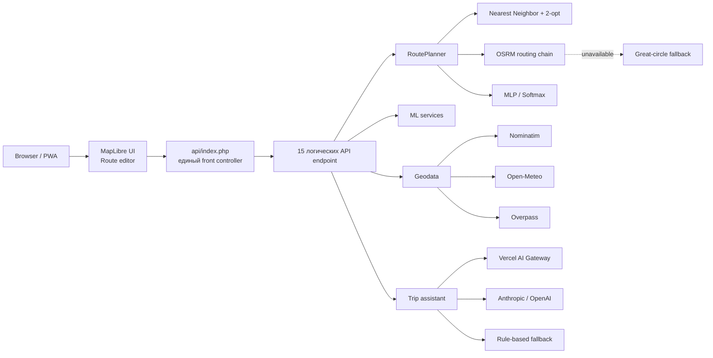

<div align="center">


<br>

[](https://smart-route-planner-vn.vercel.app/)
[](https://github.com/ViolettaNcl/smart-route-planner/actions/workflows/ci.yml)
[](https://github.com/ViolettaNcl/smart-route-planner/actions/workflows/production-smoke.yml)
[](composer.json)
[](Dockerfile)
[](LICENSE)

### Инженерный планировщик маршрутов

**TSP-оптимизация · реальные дороги · ML с нуля · explainability · fallback-архитектура · production verification**

[Открыть демо](https://smart-route-planner-vn.vercel.app/) ·
[Архитектура](docs/architecture.md) ·
[API](docs/api-reference.md) ·
[ML](docs/neural_net.md) ·
[English](README.md)

</div>

---

## Почему проект интересен технически

Smart Route Planner — не декоративная карта. Это компактная система маршрутизации, в которой классические алгоритмы, геосервисы, собственный ML-стек и production-подход к отказам соединены в один продукт.

| Область | Что реализовано |
|---|---|
| **Оптимизация** | Nearest Neighbor + 2-opt с сохранением стартовой и конечной точек |
| **Road routing** | OSRM, альтернативы, turn-by-turn, provider failover и прозрачный straight-line fallback |
| **Machine Learning** | MLP с backpropagation и Softmax baseline на PHP без ML-framework |
| **ML quality** | train/validation/test, confusion matrix, F1, log loss, Brier score, ECE, cross-validation |
| **Explainability** | probabilities, model comparison, local sensitivity, counterfactual-style analysis, Model Card |
| **Geodata** | Nominatim, Open-Meteo, Overpass, MapLibre/OpenFreeMap |
| **Reliability** | token bucket, graceful degradation, health check, HTTP integration tests, production smoke |
| **Delivery** | один Vercel PHP front controller, Docker, GitHub Actions, Playwright |

> Ограничения не скрыты: synthetic dataset, heuristic optimization, public providers и ephemeral serverless storage документируются как реальные инженерные trade-offs.

---

## Система в одном экране



На Vercel используется одна PHP Serverless Function — `api/index.php`. Она распределяет запросы между **15 логическими endpoint** в `server/endpoints/`.


---

## Возможности

### Маршрут

- Адреса или координаты, максимум **12 точек**.
- Оптимизация intermediate stops при фиксированных старте и финише.
- Реальная дорожная геометрия OSRM, alternatives и maneuver data.
- Время, стоимость и CO₂.
- Google Maps / Яндекс Карты.
- Share links без БД.
- GeoJSON / GPX / KML.
- Локальная история и избранное.

### Карта/UI

- MapLibre GL JS + OpenFreeMap.
- 2D / 3D, buildings, terrain/hillshade.
- Анимированная route scene с `prefers-reduced-motion`.
- SVG fallback при проблемах с WebGL.
- RU / EN, light / dark, PWA.

### ML / AI

- MLP с backpropagation, написанный с нуля на PHP.
- Softmax baseline.
- K-Means day splitter как отдельная unsupervised задача.
- A/B статистика MLP vs Softmax.
- Model insights / quality / Model Card.
- Review queue вместо небезопасной смены production weights в HTTP request.
- LLM через Vercel AI Gateway / Anthropic / OpenAI или rule-based fallback.

---

## Как проходит route request

1. Browser отправляет точки в `/api/route.php`.
2. `api/index.php` dispatch запрос к логическому endpoint.
3. Точки без координат геокодируются.
4. Intermediate stops оптимизируются при включённой опции.
5. OSRM строит road route.
6. При отказе OSRM система отдаёт great-circle fallback вместо полного отказа.
7. MLP или Softmax делает route-level prediction.
8. Считаются duration, cost, emissions.
9. Weather, POI, model insights и AI narrative добавляются независимо.

---

## Быстрый запуск

### Демо

**https://smart-route-planner-vn.vercel.app/**

### Локально

PHP **8.1+**, `curl`, `json`, `mbstring`.

```bash
php -S 127.0.0.1:8000 -t public tests/Http/router.php
```

Открыть `http://127.0.0.1:8000`.

### Docker

```bash
cp .env.example .env
docker compose up --build
```

Открыть `http://localhost:8080`.

---

## Quality gates

```bash
composer install
composer check
npm ci
npx playwright install chromium
npm run test:frontend
npm run test:e2e
```

Production smoke:

```bash
npm run smoke:production
```

CI проверяет PHP **8.1 / 8.2 / 8.3**.

---

## API architecture

Публичные URL:

```text
/api/route.php
/api/weather.php
/api/assistant.php
...
```

На Vercel:

```text
/api/index.php?endpoint=<logical-endpoint>
```

| Группа | Endpoint |
|---|---|
| Routing | `route`, `day_plan` |
| Geodata | `suggest`, `poi`, `weather` |
| AI | `assistant` |
| ML Insight | `decision_boundary`, `explain`, `model_insights`, `model_quality` |
| ML Feedback/Admin | `ab_stats`, `feedback`, `learn`, `reset_model` |
| Ops | `health` |

Подробнее: [API Reference](docs/api-reference.md) и [`docs/openapi.yaml`](docs/openapi.yaml).

---

## Архитектурные принципы

- **Core path before enrichment:** weather/POI/LLM не должны ломать route planning.
- **Transparent fallback:** приложение показывает фактический источник/fallback.
- **Observable ML:** quality/explainability встроены в проект.
- **Feedback ≠ instant promotion:** пользовательский feedback не переписывает production weights сразу.
- **Deployment constraints explicit:** единый Vercel front controller — сознательный design choice.

---

## Структура

```text
smart-route-planner/
├─ api/index.php
├─ server/endpoints/
├─ public/
├─ src/
│  ├─ AI/
│  ├─ Geocoding/
│  ├─ Geodata/
│  ├─ Http/
│  ├─ ML/
│  ├─ Routing/
│  ├─ Support/
│  └─ Weather/
├─ bin/
├─ tests/
├─ docs/
├─ Dockerfile
├─ docker-compose.yml
└─ vercel.json
```

---

## Документация

| Документ | Назначение |
|---|---|
| [Documentation Hub](docs/README.md) | Навигация |
| [Архитектура](docs/architecture.md) | Boundaries, runtime flow, deployment |
| [API Reference](docs/api-reference.md) | Endpoint и front-controller routing |
| [ML Engineering](docs/neural_net.md) | MLP, baseline, evaluation, explainability |
| [Setup & Operations](docs/setup_guide.md) | Local, Docker, Vercel, troubleshooting |
| [Product Analysis](docs/business_analysis.md) | Product value и ограничения |
| [`docs/openapi.yaml`](docs/openapi.yaml) | Существующий machine-readable contract |
| [CONTRIBUTING.md](CONTRIBUTING.md) | Contribution workflow |
| [SECURITY.md](SECURITY.md) | Security model |

---

## Ограничения

<details><summary><b>TSP</b></summary>
Nearest Neighbor + 2-opt — heuristic, а не гарантия global optimum.
</details>

<details><summary><b>ML dataset</b></summary>
Transport classifier обучен на synthetic data; его метрики нельзя переносить на реальное массовое поведение пользователей без дополнительных данных.
</details>

<details><summary><b>Public providers</b></summary>
OSRM, Nominatim, Overpass и Open-Meteo не дают production SLA.
</details>

<details><summary><b>Vercel storage</b></summary>
Serverless filesystem временный; file-backed state может сбрасываться при deploy/cold start.
</details>

---

## Автор

**Violetta Nicolaou** · [@ViolettaNcl](https://github.com/ViolettaNcl)

## License

[MIT License](LICENSE)

<div align="center">

Если инженерный подход оказался полезным, ⭐ помогает другим разработчикам найти проект.

</div>
