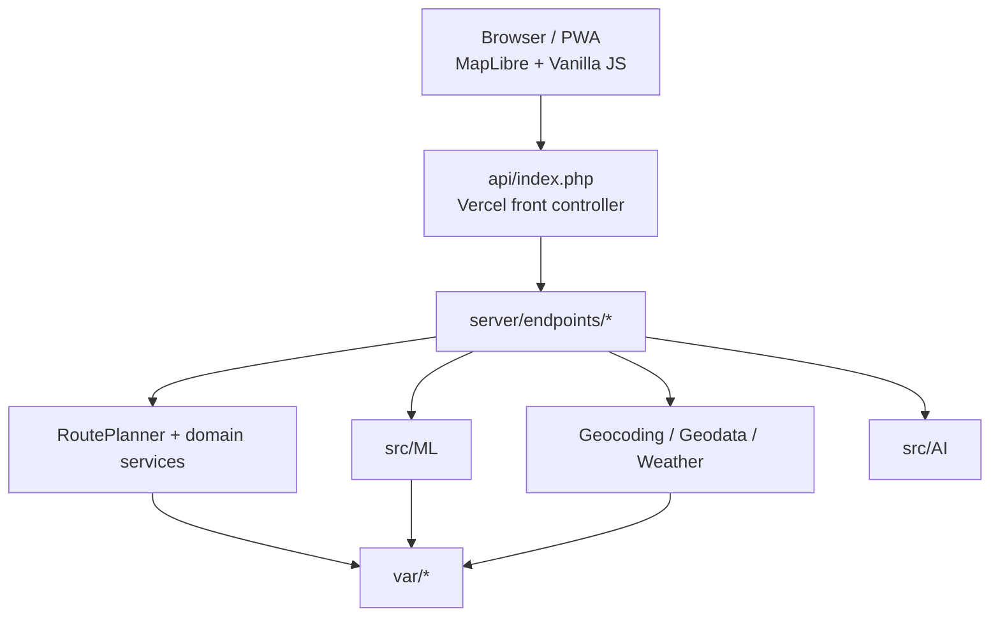

# Architecture

[Русская версия](architecture.md) · [Documentation hub](README.md)

## 1. Context

Smart Route Planner is a stateless-first web application with a PHP backend, vanilla JavaScript client, geospatial provider integrations and an in-repository ML stack.

Architectural priorities:

1. keep the core route-planning flow available when optional providers fail;
2. make fallbacks observable;
3. isolate model feedback from production inference;
4. support both Vercel and conventional PHP/Docker hosting;
5. avoid a mandatory database for the primary product flow.

## 2. High-level topology



## 3. Deployment boundary

### Vercel

`vercel.json` maps public paths such as `/api/route.php` to `api/index.php?endpoint=route`.

The front controller keeps an explicit allow-list of 15 endpoint names and loads the implementation from `server/endpoints/`.

This keeps the deployment to one PHP Serverless Function while preserving a multi-endpoint public contract.

### Docker / conventional PHP

The Docker image uses `php:8.3-apache`, sets the web root to `public/`, enables required PHP extensions and gives the runtime write access to `var/`.

On persistent Docker/VPS infrastructure, `var/` can survive restarts through the mounted volume. On Vercel it must be treated as ephemeral.

## 4. Route-planning sequence

```mermaid
sequenceDiagram
    actor User
    participant UI as Browser UI
    participant API as route endpoint
    participant Planner as RoutePlanner
    participant Geo as Geocoder
    participant Opt as RouteOptimizer
    participant Road as RoadRouter
    participant ML as TransportPredictor

    User->>UI: submit stops
    UI->>API: POST route
    API->>Planner: planStops(...)
    Planner->>Geo: resolve stops without coordinates
    Geo-->>Planner: coordinates / misses
    Planner->>Opt: optimize order
    Opt-->>Planner: ordered stop IDs
    Planner->>Road: request road route
    Road-->>Planner: route or null
    Planner->>ML: predict(distance, stops)
    ML-->>Planner: mode + confidence
    Planner-->>API: normalized result
    API-->>UI: JSON
```

`RoutePlanner` coordinates input normalization, geocoding, stop-count enforcement, route optimization, road routing, transport prediction, time/cost/emissions and response metadata.

## 5. Optimization boundary

The route optimizer uses:

- **Nearest Neighbor** for initial construction;
- **2-opt** for local improvement.

The first and last stops can remain fixed. The algorithm is intentionally heuristic: predictable runtime is preferred over a proof of global TSP optimality.

## 6. Routing resilience

OSRM-compatible providers can return road geometry, duration, alternatives and navigation steps.

If no road route is usable, the planner can fall back to great-circle geometry/distance. The response retains routing source/provider metadata so degraded behavior is visible.

## 7. Geodata services

| Concern | Service | Failure behavior |
|---|---|---|
| Geocoding | Nominatim-compatible search | unresolved stops are reported/skipped |
| Road routing | OSRM-compatible endpoints | great-circle fallback |
| Weather | Open-Meteo | enrichment can be omitted |
| POI | Overpass | enrichment can be omitted |
| Map rendering | MapLibre/OpenFreeMap | SVG route fallback can remain usable |

Rate limiting and safe HTTP behavior live under `src/Http/`.

## 8. ML architecture

Important components include:

- `MLPClassifier` — one-hidden-layer network and backpropagation;
- `SoftmaxClassifier` — linear baseline;
- `TransportPredictor` — inference facade;
- `ModelEvaluator` — evaluation metrics;
- `ModelInsightService` — prediction explanation/comparison;
- `ModelQualityService` — quality report / Model Card data;
- `KMeansDaySplitter` — separate unsupervised day-balancing problem.

Model artifacts are stored with the repository, so first-run inference does not require retraining.

## 9. Feedback / model promotion boundary

```text
HTTP inference
    ↓
anonymous feedback event
    ↓
append-only queue
    ↓
review / anomaly checks
    ↓
candidate training
    ↓
holdout quality gate
    ↓
versioned promotion / rollback
```

Public feedback is intentionally separated from immediate online mutation of shared weights.

## 10. Client architecture

The frontend is vanilla JavaScript. Responsibilities are split across modules under `public/assets/js/` for route editing, i18n, map/product interaction, ML visualization and UI/theme logic.

The browser also owns local history, favorites and export/share flows.

## 11. Logical API surface

```text
ab_stats
assistant
day_plan
decision_boundary
explain
feedback
health
learn
model_insights
model_quality
poi
reset_model
route
suggest
weather
```

See [API Reference](api-reference.en.md) and [`openapi.yaml`](openapi.yaml).

## 12. Runtime storage

`var/` is used for file-backed operational state such as caches, limiter state, logs and feedback/model workflow files.

It is not a distributed database and should not be treated as durable shared storage on serverless infrastructure.

## 13. Quality gates

CI combines Composer validation, PHP-CS-Fixer dry-run, PHPStan, `php -l`, PHP tests, frontend regression, local-server smoke, Composer audit and Playwright.

A separate production-smoke workflow validates the deployed application on a schedule and after successful main-branch CI.

## 14. Security-relevant boundaries

- `public/` is the intended document root.
- Internal source/tests/tooling stay outside the public web root.
- `api/index.php` has an explicit endpoint allow-list.
- Generic front-controller errors do not echo exception details.
- `reset_model` is an administrative operation and should require its configured token.
- Forwarded-header trust and external provider configuration require deployment review.

See [SECURITY.md](../SECURITY.md).

## 15. Trade-offs

- File-backed state is simple but not horizontally shared.
- Public providers do not offer guaranteed production SLA.
- A single Vercel function centralizes dispatch.
- Vanilla JS avoids a build pipeline but requires module discipline.
- TSP heuristics prioritize speed over exact optimality.
