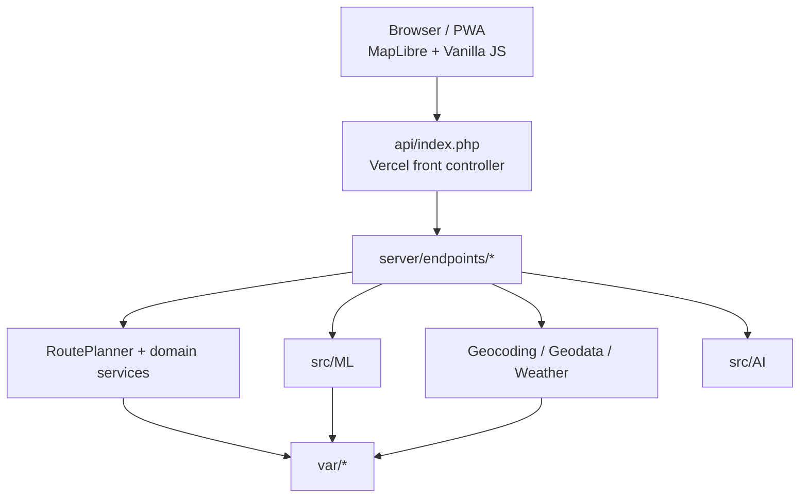

# Архитектура

[English](architecture.en.md) · [Documentation hub](README.md)

## 1. Контекст

Smart Route Planner — stateless-first веб-приложение на PHP с vanilla JavaScript, геосервисами и ML-стеком внутри репозитория.

Приоритеты:

1. основной route flow должен переживать отказ optional provider;
2. fallback должен быть видимым;
3. model feedback отделён от production inference;
4. проект запускается на Vercel и в PHP/Docker;
5. core flow не требует database.

## 2. Топология



## 3. Deployment boundary

### Vercel

`vercel.json` направляет `/api/route.php` и другие публичные endpoint в `api/index.php?endpoint=<name>`.

Front controller использует explicit allow-list из 15 endpoint и подключает implementation из `server/endpoints/`.

### Docker / PHP hosting

Docker использует `php:8.3-apache`, web root `public/`, необходимые PHP extensions и writable `var/`.

На VPS/Docker `var/` можно хранить persistent. На Vercel filesystem нужно считать ephemeral.

## 4. Route flow

```mermaid
sequenceDiagram
    actor User
    participant UI as Browser UI
    participant API as route endpoint
    participant Planner as RoutePlanner
    participant Geo as Geocoder
    participant Opt as RouteOptimizer
    participant Road as RoadRouter
    participant ML as TransportPredictor

    User->>UI: ввод точек
    UI->>API: POST route
    API->>Planner: planStops(...)
    Planner->>Geo: geocode missing coordinates
    Geo-->>Planner: coordinates / misses
    Planner->>Opt: optimize order
    Opt-->>Planner: ordered stop IDs
    Planner->>Road: road route
    Road-->>Planner: route or null
    Planner->>ML: predict(distance, stops)
    ML-->>Planner: mode + confidence
    Planner-->>API: normalized result
    API-->>UI: JSON
```

`RoutePlanner` координирует normalization, geocoding, stop limit, optimization, road routing, ML prediction, time/cost/emissions и metadata источника.

## 5. Оптимизация

Используются:

- **Nearest Neighbor** — начальная конструкция;
- **2-opt** — локальное улучшение.

Старт и финиш можно фиксировать. Это heuristic, не доказанный global optimum.

## 6. Routing resilience

OSRM-compatible provider возвращает geometry/duration/alternatives/steps.

Если road route недоступен, возможен great-circle fallback. Metadata ответа показывает реальный источник.

## 7. Geodata

| Задача | Provider | При отказе |
|---|---|---|
| Geocoding | Nominatim-compatible | unresolved stops возвращаются отдельно |
| Road routing | OSRM-compatible | great-circle fallback |
| Weather | Open-Meteo | enrichment пропускается |
| POI | Overpass | enrichment пропускается |
| Map | MapLibre/OpenFreeMap | SVG fallback |

## 8. ML

Компоненты:

- `MLPClassifier`;
- `SoftmaxClassifier` baseline;
- `TransportPredictor`;
- `ModelEvaluator`;
- `ModelInsightService`;
- `ModelQualityService`;
- `KMeansDaySplitter`.

Model artifacts входят в репозиторий.

## 9. Feedback → release

```text
HTTP inference
    ↓
feedback
    ↓
append-only queue
    ↓
review / anomaly checks
    ↓
candidate training
    ↓
holdout quality gate
    ↓
promotion / rollback
```

Feedback не должен менять production weights внутри обычного request.

## 10. Frontend

Frontend — vanilla JS. Модули в `public/assets/js/` разделяют route editor, i18n, map/product logic, ML visualization, UI/theme.

## 11. API

15 логических endpoint:

```text
ab_stats, assistant, day_plan, decision_boundary, explain,
feedback, health, learn, model_insights, model_quality,
poi, reset_model, route, suggest, weather
```

См. [API Reference](api-reference.md) и [`openapi.yaml`](openapi.yaml).

## 12. Runtime storage

`var/` хранит file-backed caches, limiter state, logs и feedback/model workflow state.

Это не distributed durable database.

## 13. Quality gates

CI: Composer validation, PHP-CS-Fixer, PHPStan, `php -l`, PHP tests, frontend regression, server smoke, Composer audit, Playwright.

Отдельный workflow проверяет production.

## 14. Security boundaries

- document root — `public/`;
- internal source/tests/tooling не должны быть web-accessible;
- front controller имеет allow-list;
- generic error не раскрывает stack trace;
- `reset_model` — admin operation;
- proxy/header trust требует аккуратной настройки.

См. [SECURITY.md](../SECURITY.md).

## 15. Trade-offs

- file state не shared между instance;
- public provider без SLA;
- single front controller — центральный dispatch point;
- vanilla JS требует дисциплины модулей;
- TSP heuristic выбирает скорость вместо exact optimum.
