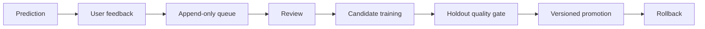

# Machine Learning Engineering

[Русская версия](neural_net.md) · [Documentation hub](README.md)

## Scope

The project contains three different ML/AI problems:

1. **Transport classification** — supervised classification with an MLP and a linear Softmax baseline.
2. **Trip day splitting** — an unsupervised K-Means problem.
3. **Trip narrative** — LLM/rule-based text generation, separate from the transport classifier.

## MLP implementation

`src/ML/MLPClassifier.php` implements a trainable feed-forward network without an external ML framework.

The implementation includes feature encoding, hidden-layer activations, Softmax probabilities, forward/backward passes, gradient-based updates and serialized runtime weights.

The value is transparency: the mechanics are inspectable instead of hidden behind a framework call.

## Baseline

`SoftmaxClassifier` provides a linear baseline.

A baseline matters because a more complex model is not automatically better. Model quality should be compared against the simpler alternative rather than inferred from architecture complexity.

## Feature domain

Runtime transport prediction uses route-level features such as distance and stop count.

That makes the model easy to visualize and explain, but limits what it can learn about real traveler behavior.

## Dataset limitation

The training dataset is synthetic.

Therefore:

- reported metrics describe the project's generated/evaluation distribution;
- they are not evidence of broad real-world traveler-preference accuracy;
- a production ML roadmap would require consent-aware data collection, richer features, drift monitoring and data governance.

## Evaluation

The repository's evaluator/quality tooling covers more than raw accuracy:

- confusion matrix;
- per-class precision / recall / F1;
- macro-F1;
- log loss;
- multiclass Brier score;
- calibration / ECE;
- cross-validation.

That is important for a multiclass probability model because top-1 accuracy alone does not describe confidence quality.

## Explainability

The model insight surface can expose:

- class probabilities;
- MLP vs. Softmax comparison;
- winning margin;
- local feature sensitivity;
- nearest examples;
- counterfactual-style boundary search;
- network/model metadata;
- quality / Model Card information.

These are interpretation aids, not causal explanations.

## Review path

```text
src/ML/Dataset.php
src/ML/FeatureEncoder.php
src/ML/MLPClassifier.php
src/ML/SoftmaxClassifier.php
src/ML/ModelEvaluator.php
src/ML/TransportPredictor.php
src/ML/training_report.json
bin/train_model.php
```

## Retraining

```bash
php bin/train_model.php
```

Retraining is not required for first launch because model artifacts are committed with the repository.

## Feedback boundary



This is safer than naive online learning from arbitrary web feedback.

## K-Means day planning

`KMeansDaySplitter` is separate from the supervised classifier. It handles an unsupervised grouping/balancing problem while preserving route-order constraints.

## LLM assistant

The trip assistant can use:

1. Vercel AI Gateway;
2. direct Anthropic/OpenAI provider configuration;
3. a rule-based offline fallback.

The source of the generated result should remain visible to the client.

## What this ML layer does well

- exposes model mechanics;
- keeps a simple baseline;
- evaluates more than accuracy;
- includes explainability tooling;
- separates feedback collection from model promotion;
- makes degraded AI behavior explicit.

## What it does not claim

- no claim of state-of-the-art route intelligence;
- no claim that synthetic-data scores equal real-world preference accuracy;
- no claim that the MLP must outperform the linear model;
- no claim that a local explanation proves causality.
