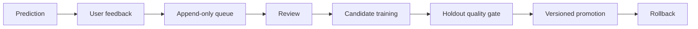

# ML Engineering

[English](neural_net.en.md) · [Documentation hub](README.md)

## Задачи

В проекте есть три разные ML/AI постановки:

1. **Transport classification** — supervised MLP + linear Softmax baseline.
2. **Day splitting** — unsupervised K-Means.
3. **Trip narrative** — LLM/rule-based text generation, отдельный слой.

## MLP

`src/ML/MLPClassifier.php` реализует trainable feed-forward сеть без внешнего ML-framework.

Внутри: feature encoding, hidden activations, Softmax probabilities, forward/backward pass, gradient update и serialized runtime weights.

Ценность реализации — прозрачность механики.

## Baseline

`SoftmaxClassifier` — linear baseline.

Более сложная архитектура не означает более качественную модель автоматически, поэтому baseline остаётся обязательной точкой сравнения.

## Features

Runtime transport prediction использует route-level признаки, включая distance и stop count.

Такое пространство легко визуализировать, но оно ограничивает способность модели отражать реальное поведение путешественников.

## Synthetic dataset

Training data синтетический.

Следовательно:

- метрики относятся к generated/evaluation distribution проекта;
- их нельзя выдавать за доказанную real-world accuracy;
- production ML потребовал бы consent-aware data collection, richer features, drift monitoring и governance.

## Evaluation

Используются не только accuracy:

- confusion matrix;
- precision / recall / F1;
- macro-F1;
- log loss;
- multiclass Brier score;
- calibration / ECE;
- cross-validation.

## Explainability

Model insight может включать:

- probabilities;
- MLP vs Softmax;
- winner margin;
- local feature sensitivity;
- nearest examples;
- counterfactual-style boundary search;
- model/network metadata;
- Model Card / quality data.

Это interpretation aids, не causal proof.

## Review path

```text
src/ML/Dataset.php
src/ML/FeatureEncoder.php
src/ML/MLPClassifier.php
src/ML/SoftmaxClassifier.php
src/ML/ModelEvaluator.php
src/ML/TransportPredictor.php
src/ML/training_report.json
bin/train_model.php
```

## Retraining

```bash
php bin/train_model.php
```

Для первого запуска retraining не нужен.

## Feedback boundary



Web feedback не должен напрямую менять shared production weights.

## K-Means

`KMeansDaySplitter` — отдельная unsupervised задача, сохраняющая route-order constraints.

## LLM assistant

Возможные источники:

1. Vercel AI Gateway;
2. Anthropic/OpenAI;
3. rule-based fallback.

Источник результата должен быть видим клиенту.

## Сильные стороны

- прозрачная реализация;
- baseline;
- метрики качества;
- explainability;
- separation feedback/promotion;
- explicit fallback.

## Что не заявляется

- state-of-the-art intelligence;
- перенос synthetic metrics на real-world users;
- гарантированное превосходство MLP;
- causal meaning local explanations.
